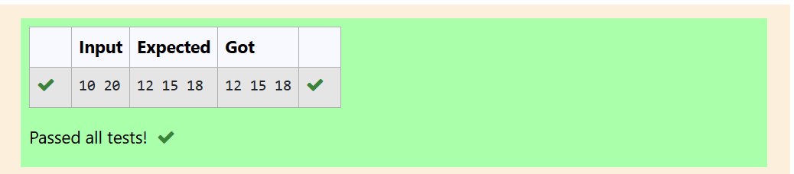
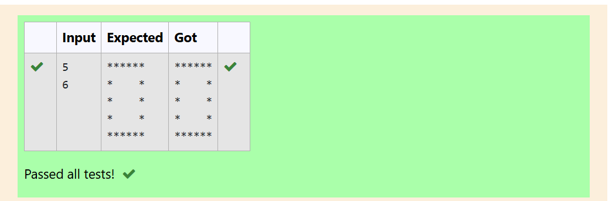
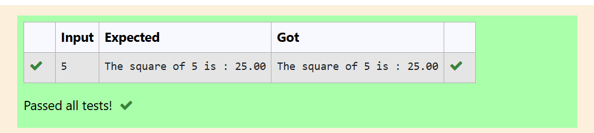
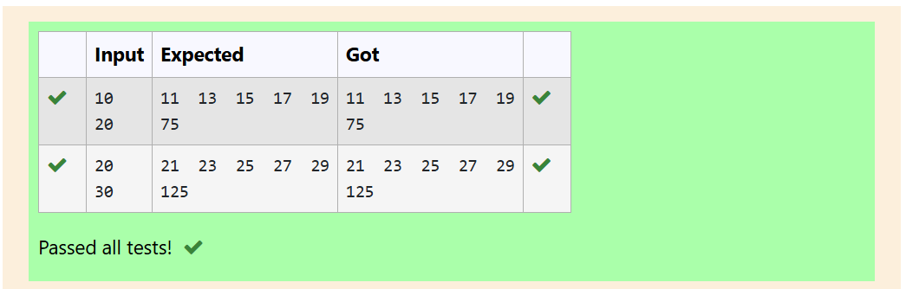
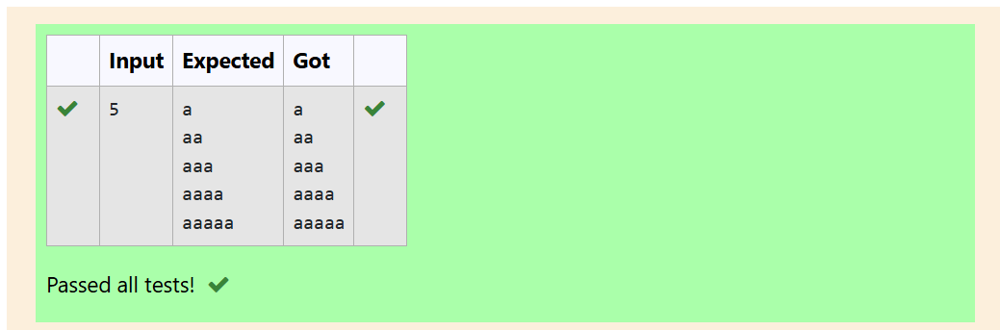

# MODULE-2
---
# EXP NO:6 C PROGRAM TO PRINT NUMBERS DIVISIBLE BY 3 IN A RANGE

## Aim:

Write a C program that takes a starting number (M) and an ending number (N) and prints all the whole numbers between them (inclusive) that are perfectly divisible by 3.

## Algorithm:

1. Start.

2. Declare integer variables: a (start) and b (end).

3. Get the range values (a and b) from the user.

4. Use a for loop to check every number (i) starting from a up to and including b.

5. Inside the loop, use the modulo operator (%) to check if i % 3 is equal to 0.

6. If True, print the number i.

7. Stop.

## Program:
```
#include <stdio.h>
int main(){
    int a,b;
    scanf("%d %d",&a,&b);
    for (int i=a;i<=b;i++){
        if (i%3==0)
            printf("%d ",i);
    }
    return 0;
}
```

## Output:

## Result:

The C program to find and display all numbers divisible by 3 within a user-defined range was executed and verified successfully.

---
#
---

# EXP NO:7 C PROGRAM TO PRINT HOLLOW RECTANGULAR PATTERN

## Aim:

Write a C program to take two integer inputs, representing the number of rows (r) and columns (c), and print a hollow rectangular pattern made of asterisks (*) to the console.

## Algorithm:

1. Start.

2. Declare four integer variables: r (rows), c (columns), i (row counter), and j (column counter).

3. Get the dimensions (r and c) from the user.

4. Use an outer for loop (counter i) to iterate through the rows, from 1 to r.

5. In the outer loop's control section, print a newline character (\n) to move to the next line after each row is complete.

6. Use an inner for loop (counter j) to iterate through the columns, from 1 to c.

7. Inside the inner loop, use an if condition to check if the current position is on one of the borders:

    - j == 1 (First column) OR j == c (Last column) OR

    - i == 1 (First row) OR i == r (Last row)

8. If True, print an asterisk (*).

9. If False (it's inside the rectangle), print a space (     ).

10. Stop.

## Program:
```
#include <stdio.h>
int main(){
    int r,c,i,j;
    scanf("%d %d", &r, &c);
    for (i=1;i<=r;printf("\n"),i++){
        
        for (j=1;j<=c;j++){
            if ((j==1 || j==c) || (i==1||i==r) )
                printf("*");

            else printf(" ");
        }
    }
    return 0;
}
```

## Output:


## Result:

The C program to print a hollow rectangular pattern of a user-defined size using nested loops and conditional statements was executed and verified successfully.

---
#
---
# EXP NO:8 C PROGRAM TO FIND SQUARE USING VOID FUNCTION

## Aim:

Write a C program to find and print the square of a floating-point number using a custom function that accepts an argument but has no return value (void).

## Algorithm:

1. Start.

2. Define a function sq(float s) above main(). This function takes the number as input and prints the result directly.

3. In main(), declare a float variable n and get the number input from the user.

4. Call the function sq(n), passing the input number n to it.

5. Inside sq(), calculate the square (s * s) and print the result.

6. Stop.

## Program:
```
#include <stdio.h>
void sq(float s){
    printf("The square of %.0f is : %.2f",s,s*s);
}
int main(){
    float n;
    scanf("%f",&n);
    sq(n);
    return 0;
}
```

## Output:

## Result:

The C program to find the square of a number using a user-defined function with arguments and no return value was executed and verified successfully.

---
#
---

# EXP NO:9 C PROGRAM TO FIND SUM OF ODD DIGITS IN RANGE

## Aim:

Write a C program to find and display all odd numbers and their total sum within a specified range (M to N) using a loop.

## Algorithm:

1. Start.

2. Declare integer variables a (start of range), b (end of range), i (loop counter), and sum, initialized to 0.

3. Read the two range limits, a and b, from the user.

4. Check if the starting number a is even. If it is, increment a so the loop starts on the first odd number.

5. Use a for loop starting at a and continuing until it reaches b (incrementing by 2 in each step to hit only odd numbers).

6. Inside the loop, print the current odd number (i) and add it to the sum.

7. After the loop finishes, print the final total sum.

8. Stop.

## Program:
    ```
#include <stdio.h>
int main(){
    int i,a,b,sum=0;
    scanf("%d",&a);
    scanf("%d",&b);
    if (a%2==0)a++;
    for (i=a;i<=b;i+=2){
        printf("%d ",i);
        sum+=i;
    }
    printf("\n%d",sum);
    return 0;
}
```

## Output:


## Result:

The C program to find the sum of odd numbers within a given range was executed and verified successfully.

---
#
---
# EXP NO:10 C PROGRAM TO PRINT ALPHABET PATTERN

## Aim:

Write a C program to print a right-angled triangular pattern of the letter 'a' based on a given number of rows using nested loops.

## Algorithm:

1. Start.

2. Declare an integer variable n for the number of rows.

3. Read the input n (the number of rows) from the user.

4. Use an outer for loop (variable i) to iterate from 1 up to n (to handle each row).

5. Use an inner for loop (variable j) to iterate from 1 up to the current row number (i).

6. Inside the inner loop, print the character 'a'.

7. After the inner loop finishes (i.e., the row is complete), print a newline character (\n) to move to the next line.

8. Stop.

## Program:
```
#include <stdio.h>
int main(){
    int n;
    scanf("%d",&n);
    for (int i=1;i<=n;printf("\n"),i++){
        for (int j =1;j<=i;j++)printf("a");
    }
    return 0;
}
```

## Output:

## Result:

The C program to print a triangular alphabetic pattern using nested loops was executed and verified successfully.

---
